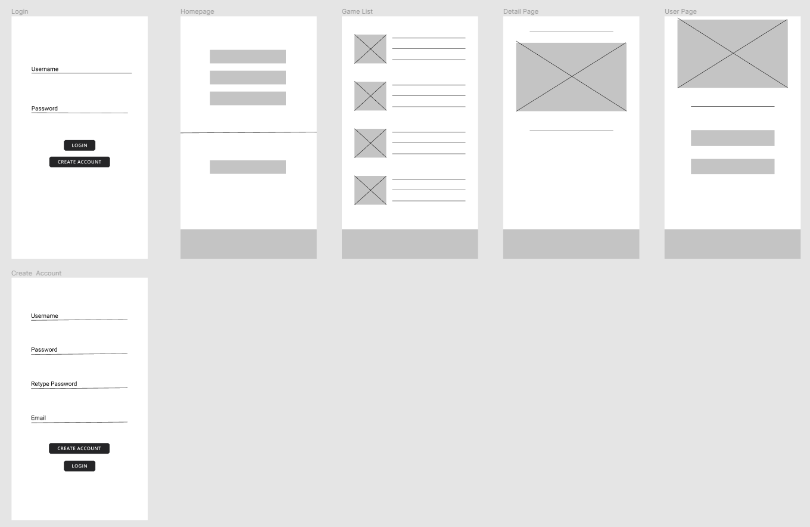
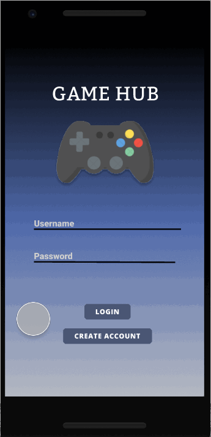

Original App Design Project - README Template
===

# Game Hub

## Table of Contents
1. [Overview](#Overview)
1. [Product Spec](#Product-Spec)
1. [Wireframes](#Wireframes)
2. [Schema](#Schema)

## Overview
### Description
This app allows for video game users to view the all their video games. They will be able to find a description and reviews of any video game on the market. This allows the user to make a better selection before making a purchase. The user can also like their favorite video game through the app. This will allow them to view all liked video games after signing in on a different device. This means they'd be able to show friends and followers their favorite video games.

### App Evaluation
- **Category:** Entertainment
- **Story:** We want a platform where users can feel at home and come together over things that they are passionate about. Not only will they be able to use the platform to expand their knowledge and interests, but being able to collectively "like" games and potentially find new sources of content for those games is really what it's about.
- **Market:** Users who are interested in videogames, enthusiasts and hobbyists.
- **Habit:** The intention for this app will be to create a place that the user can go to find new games and create their own collection of liked games. It's intentionally designed to be something that can be picked up and put down at any time, without being too addictive for any unecessary reason.
- **Scope:** Users will be able to create an account, log in, search a videogame database based on hot topics such as "Top rated", "New releases" and "Trending" or search by genre. Once games are populated on the screen, the user will be able to click on any game of their choosing to bring up a more detailed page that will host a game image, video (if applicable), description, and any other integrations available for that game (Youtube/Twitch/Store links if applicable).

## Product Spec

### 1. User Stories (Required and Optional)

**Required Must-have Stories**

- [ ]  Account creation/login
- [ ]  Timeline (games)
- [ ]  Details page for each game
    - [ ]  Display game image and title
    - [ ] Ability to like the game
    - [ ] Show game description
    - [ ] Send user to buy page if they choose to buy
- [ ] User profile page
    - [ ] Can view who is signed in as well as displays temporary profile picture
    - [ ] User can sign out
- [ ] Search for games
- [ ] User can find games by genre, top tending, new releases, etc.
- [ ] Display a list of games with game title, image, and short description of game

**Optional Nice-to-have Stories**

- [ ] Display reviews for games on the details page
- [ ] Allow user to view all liked games
- [ ] Send user to twitch to watch the game being played (twitch integration)
- [ ] Youtube trailer on game details page
- [ ] Upload picture to a profile

### 2. Screen Archetypes

* Login Screen
   * Login
* Registration Screen
   * Account creation
* Homepage
   * Timeline (games)
   * Search for games
   * User can select games by genre, top tending, new releases, etc.
* Game List Page
   * Display a list of games with game title, image, and short description of game
* Details Page
   * Display game image and title
   * Ability to like the game 
   * Show game description
   * Send user to buy page if they choose to buy
* Profile Page
   * Can view who is signed in as well as displays temporary profile picture
   * User can sign out

### 3. Navigation

**Tab Navigation** (Tab to Screen)

* Home Feed
* Search Games
* User Profile

**Flow Navigation** (Screen to Screen)

* **Login**
   * Login -> Homepage
   * Login -> Account Creation
* **Account Creation**
   * Account Creation -> Login
* **Home Feed**
    * Home Feed -> Game List Page
* **Game List Page**
    * Game List Page -> Game Details
    * Game List Page -> Home Feed
* **Game Details**
    * Game Details -> Game List Page
* **User Profile**
    * User Profile -> Login

## Wireframes
[Add picture of your hand sketched wireframes in this section]

### [BONUS] Digital Wireframes & Mockups

### [BONUS] Interactive Prototype

## Schema 
[This section will be completed in Unit 9]
### Models
[Add table of models]
### Networking
- [Add list of network requests by screen ]
- [Create basic snippets for each Parse network request]
- [OPTIONAL: List endpoints if using existing API such as Yelp]
